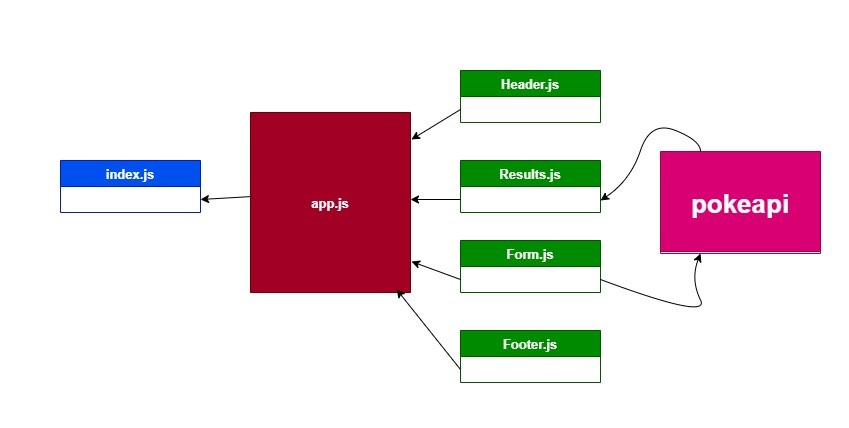

# RESTy App

# SOLUTION - Component Based UI

- convert React class components into a function components.
- make refactoring in a starte code.

### PR link :

- [https://github.com/Ahmad-AbuOsbeh/resty/pull/1](https://github.com/Ahmad-AbuOsbeh/resty/pull/1)

### Deployment link:

- [https://bgcoq.csb.app/](https://bgcoq.csb.app/)

### UML

- 

   
   

# useState() Hook

- convert app component from class to function components.
- use useState hook.
- make testing.
- add some css.
- work on some features to handle the API requests.

### PR link :

- [https://github.com/Ahmad-AbuOsbeh/resty/pull/2](https://github.com/Ahmad-AbuOsbeh/resty/pull/2)

### Deployment link:

- [lab27-Sandbox-link](https://codesandbox.io/s/gallant-galois-cctxl)
- [https://2pg5x.csb.app/](https://2pg5x.csb.app/)

### UML

- 
