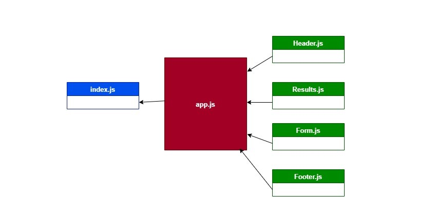

# SOLUTION - Component Based UI

- convert React class components into a function components.
- make refactoring in a starte code.

## PR link :

- [https://github.com/Ahmad-AbuOsbeh/resty/pull/1](https://github.com/Ahmad-AbuOsbeh/resty/pull/1)

# Deployment link:

- [https://bgcoq.csb.app/](https://bgcoq.csb.app/)

# UML

- 
